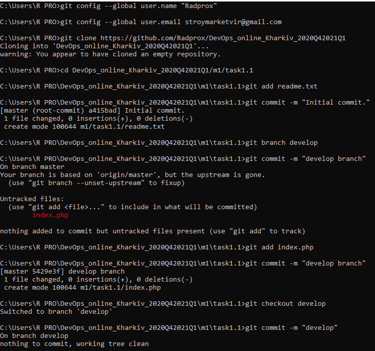
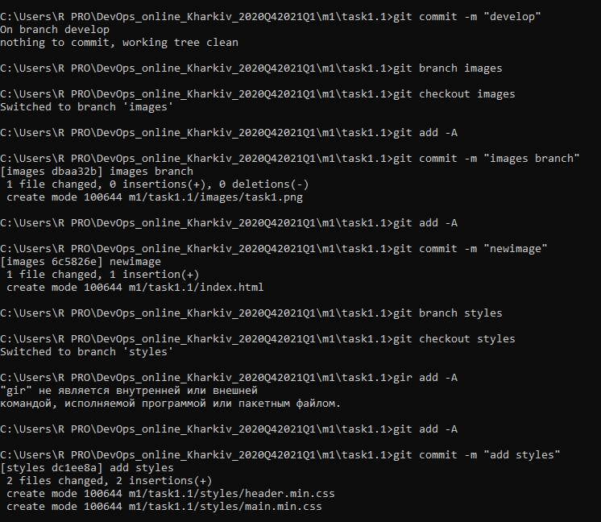
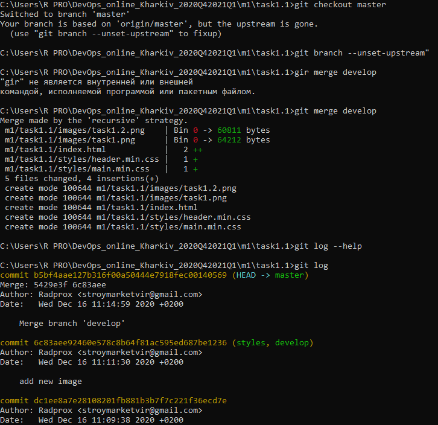
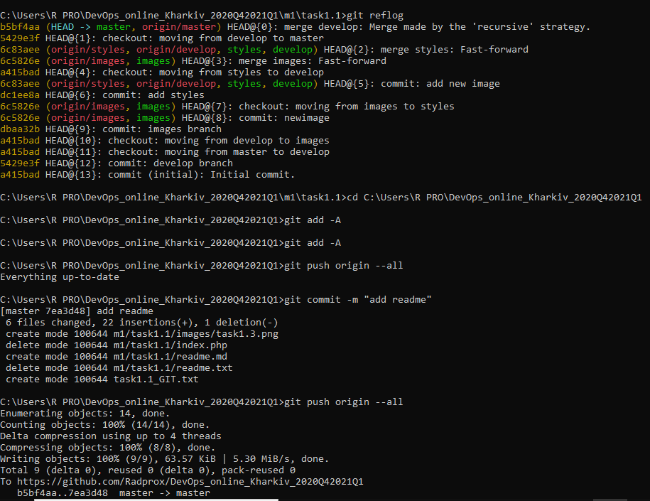
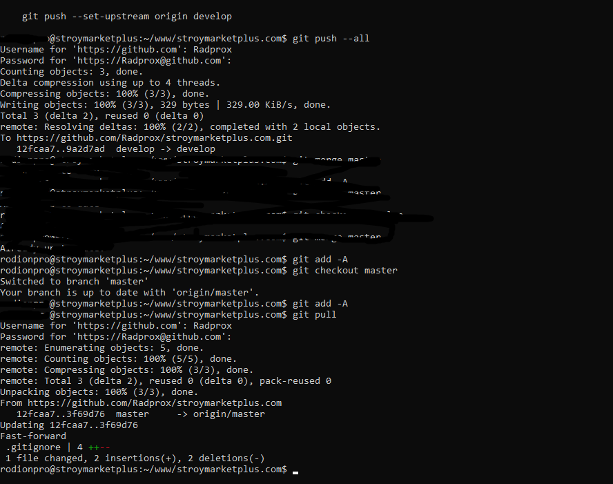

<h2>Git is a great solution for managing large projects.</h2>

 The system for tracking changes in the code, version control of files and more.

 It is especially convenient when working in a team with different cases.

 I have implemented repository with my website, work great. Now I wonder how to connect Git and a database MySql?

<h2><strong>DevOps</strong> engineer is a link between developers and operations.</h2>

Creates and configures infrastructure for projects, 
provides automation of development and testing processes, deploys the working environment, eliminates security vulnerabilities, 
testing, monitoring and maintenance of application infrastructure, improves the Mean Time to Recovery and more

I find similarities with a film director or architect :)

<h2 style="text-align:center;color:gold;">Screenshots Git</h2>		  

<h2 style="text-align:center;color:gold;">Git on my website</h2>

 
