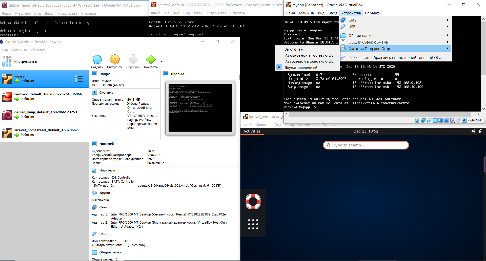
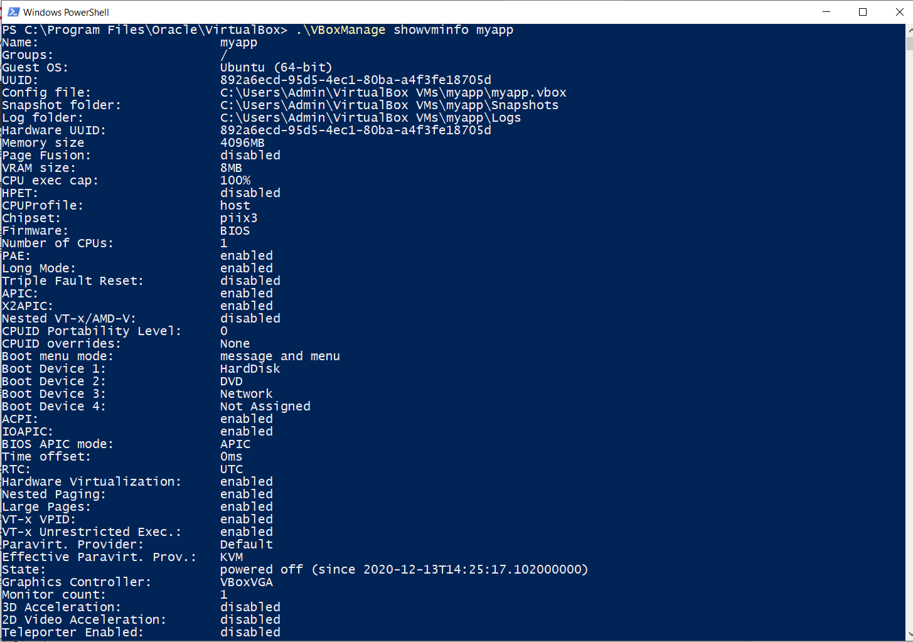
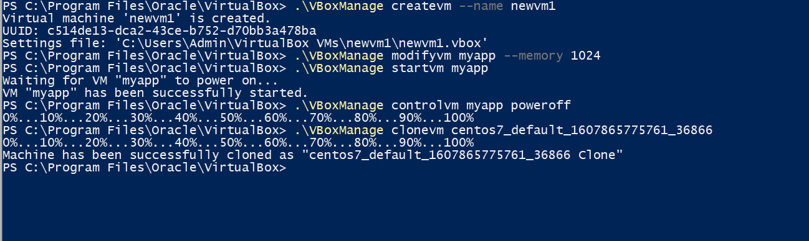
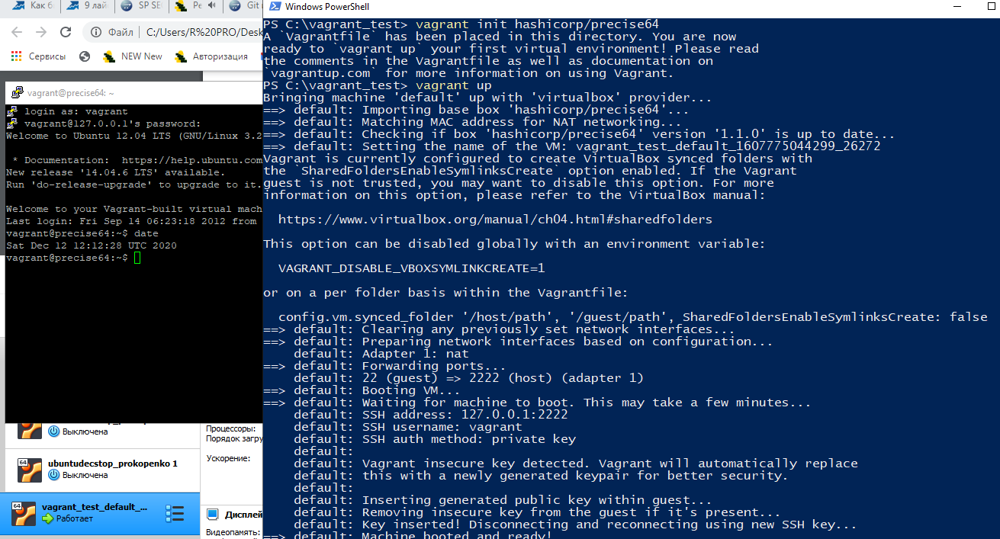
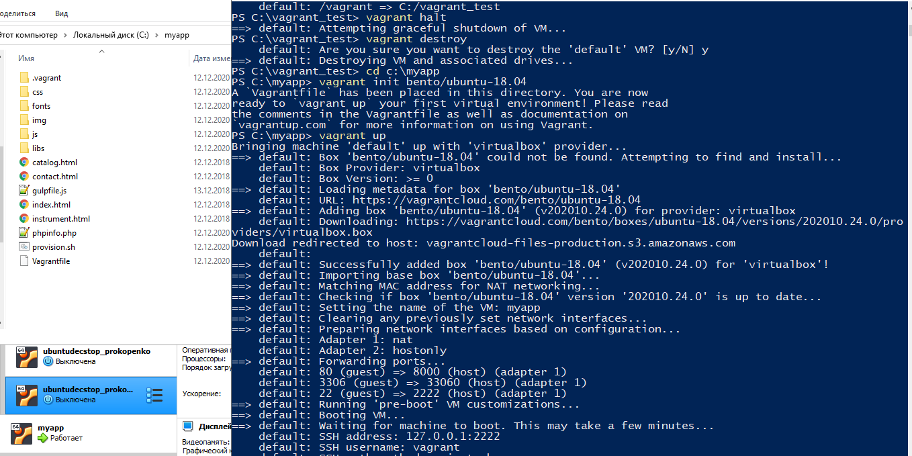
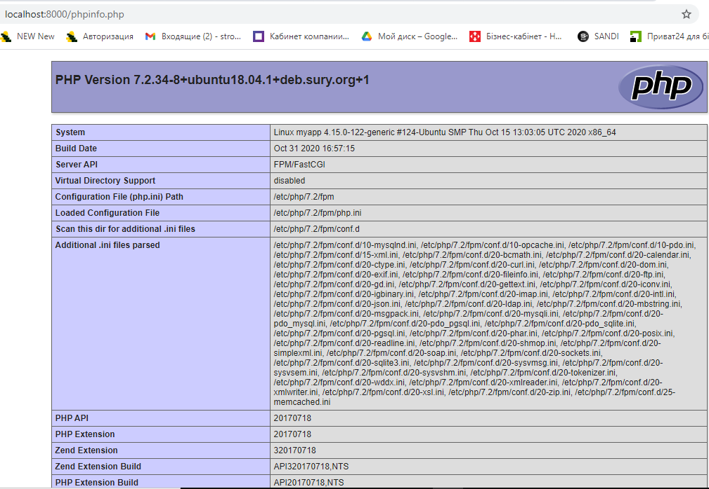

<h2>Most popular hypervisors: <strong>Oracle Virual Box, VMware, Microsoft Hyper V, Linux KVM, Xen</h2>

 Hypervisors have different performance, feature set, interface, application possibilities, platfotms, license and payment terms.

<h1>Task 2.1: Vbox and Vagrant</h1>
<h2>Part 1: Virtual box</h2>		  

<h2 style="text-align:center;color:gold;">Part 2: Vagrant</h2>

<h2 style="text-align:center;color:gold;">Vagrant UP</h2>

