<h1>Task 2.2: Amazing AWS</h1>
		
<h2>Lightsail</h2>		

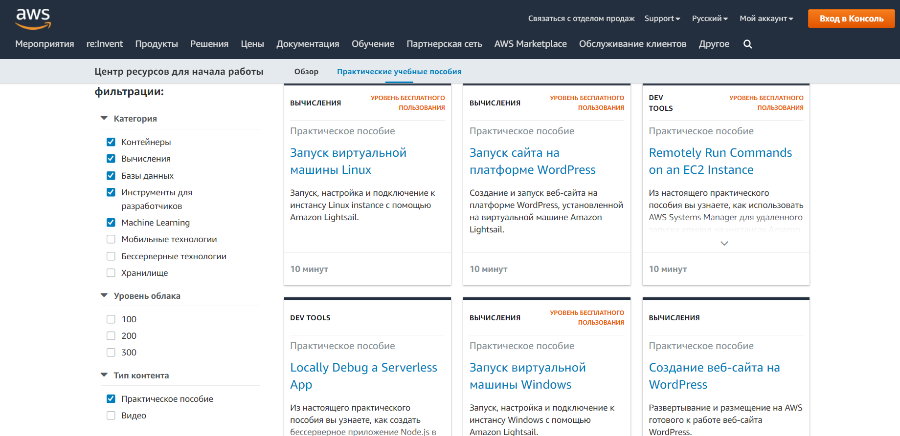

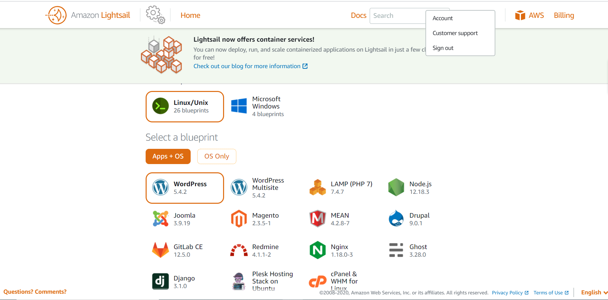

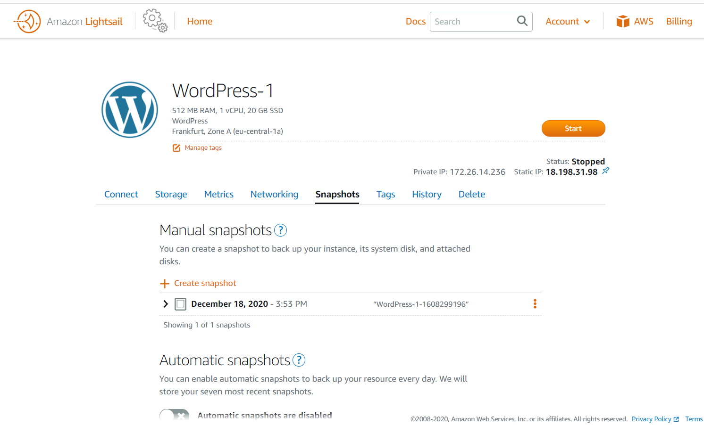

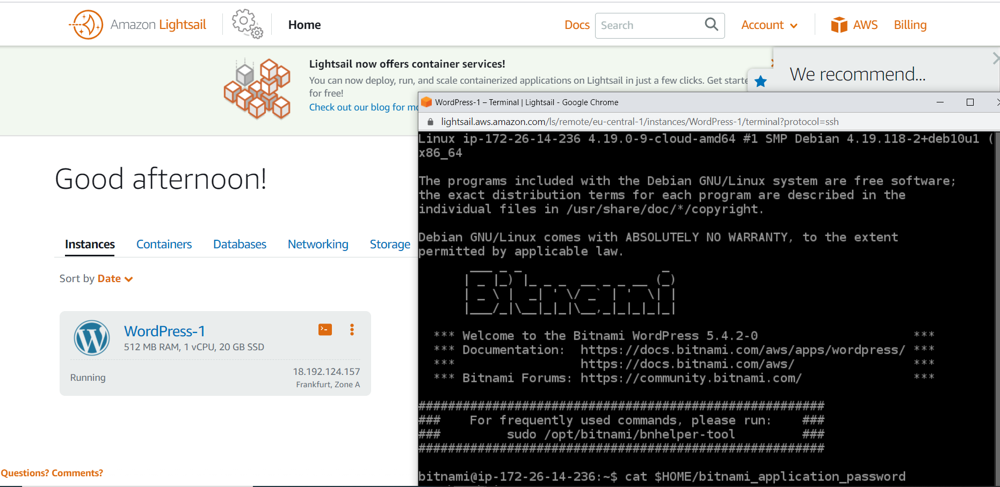

<h2>EC2</h2>	

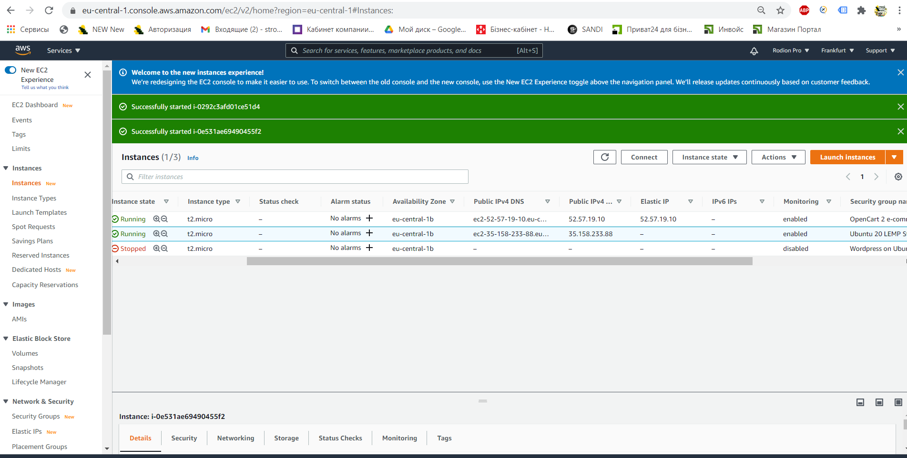

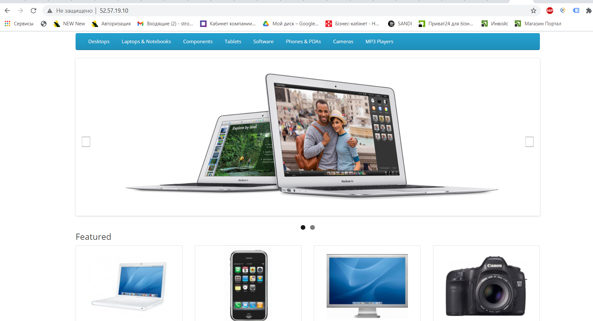

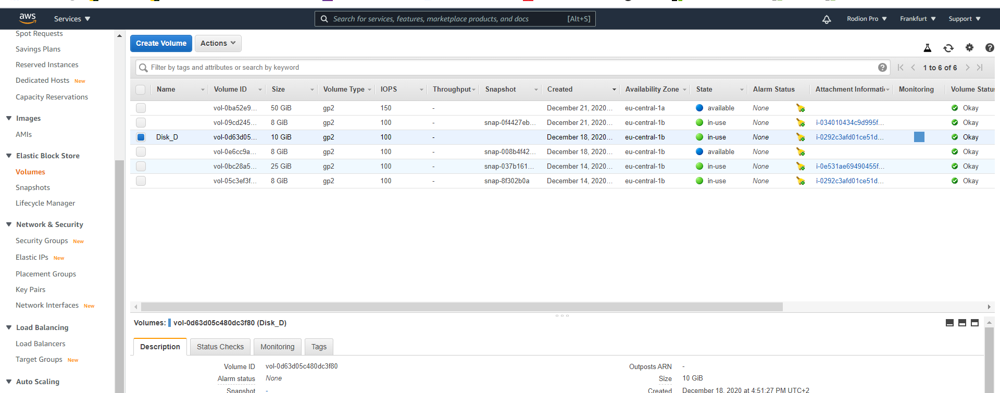

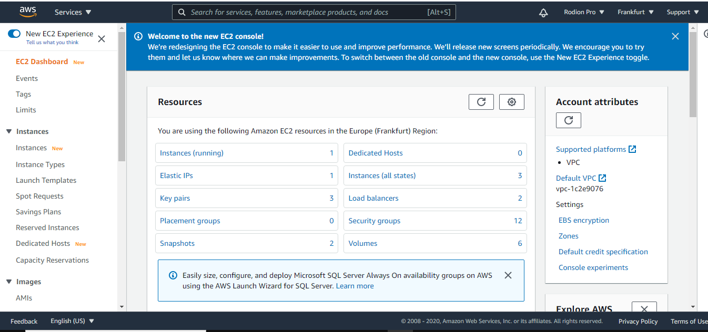

<h2>ECS</h2>	

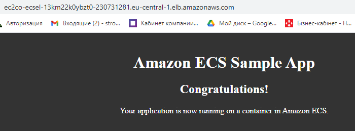

<h2>Route53</h2>	

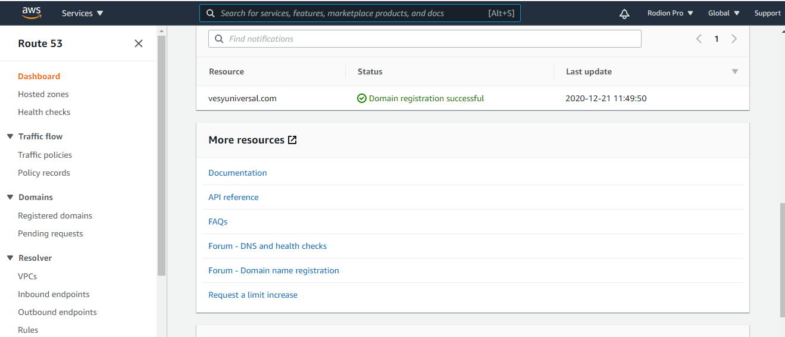

<h2>S3 static</h2>	

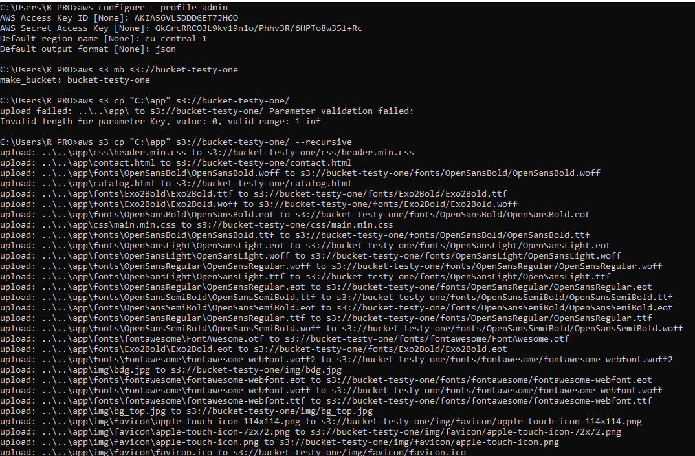

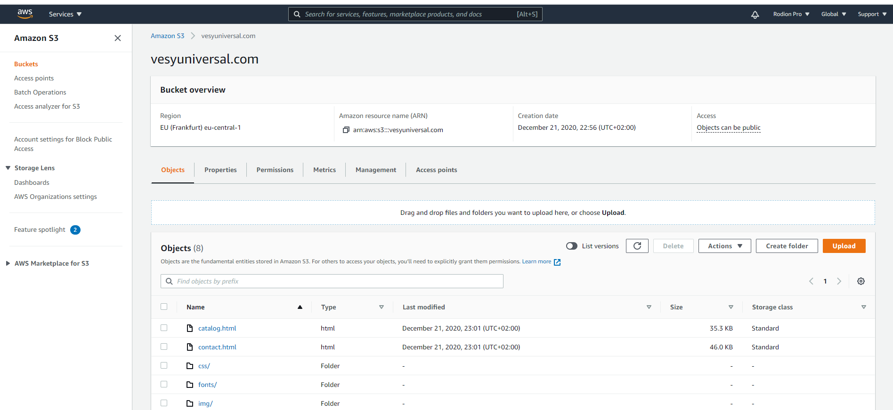

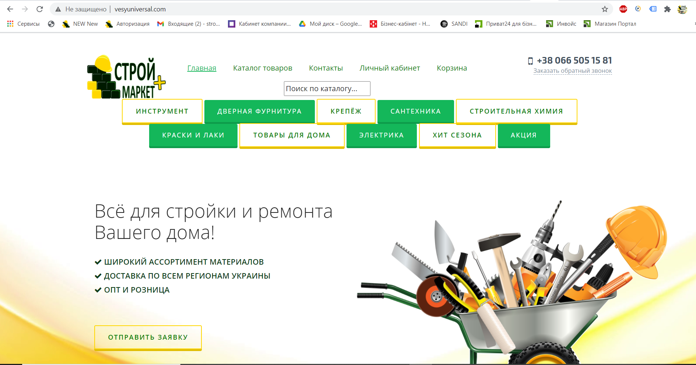

 
 

In the process of homework, I got acquainted with the EC2 instanses and EBS, S3 buckets, Lightsail platform, ECS containers, Route 53, VPC, DynamoDb, RDS, IAM and security. 

These services are really incredible, and have all the necessary tools to quickly deploy any application

Also i enjoy security challenge, its awesome!

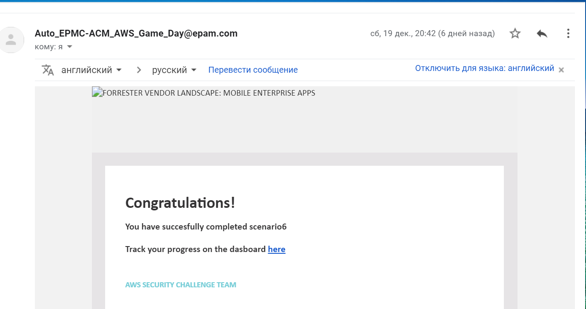
