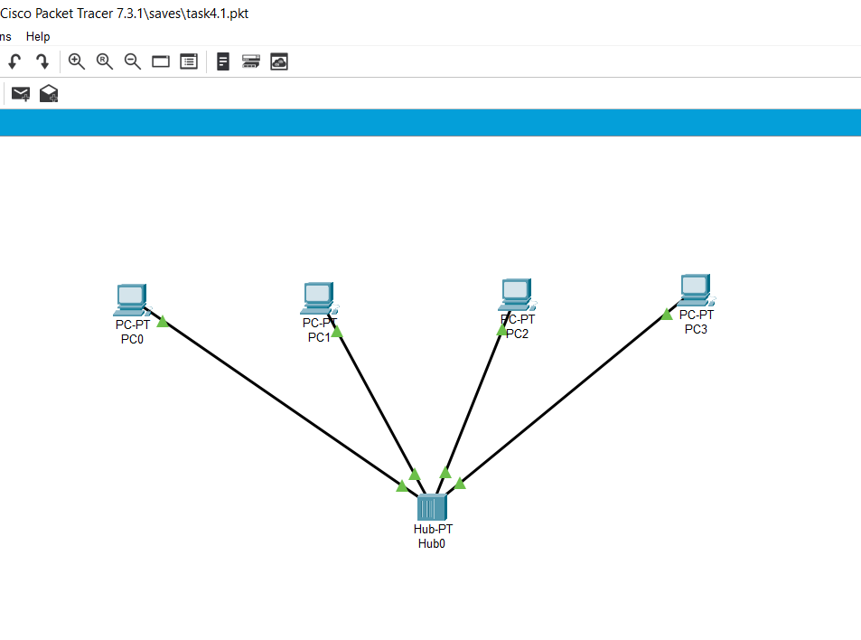
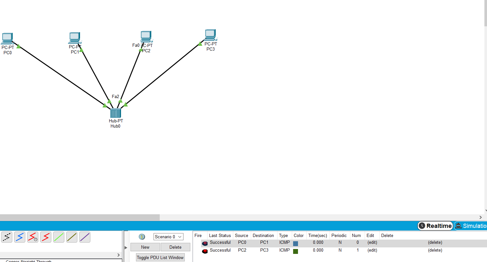
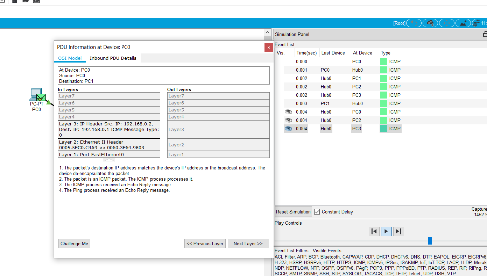
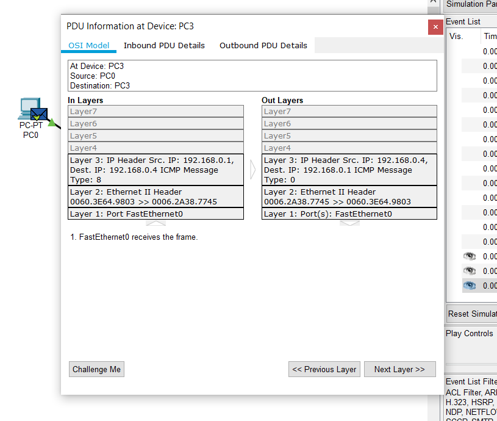
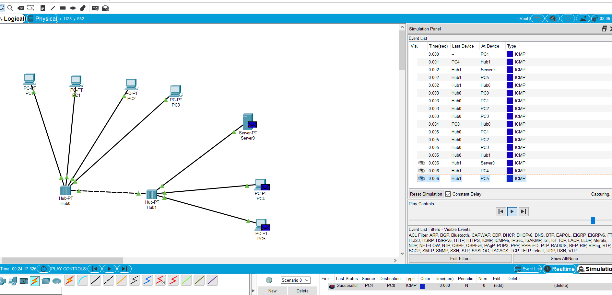
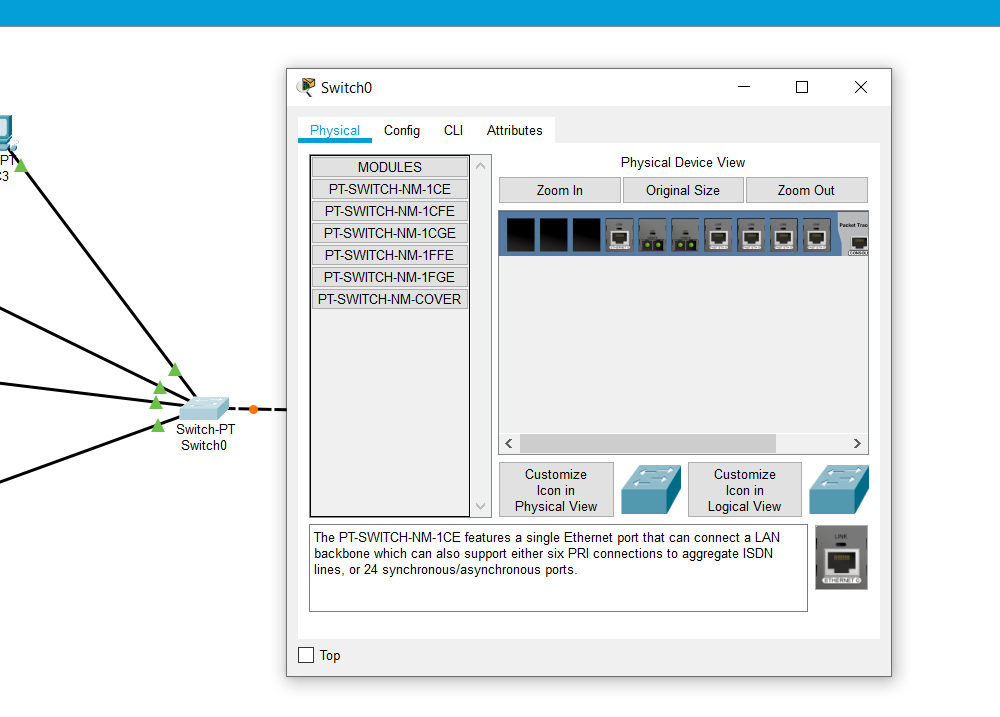
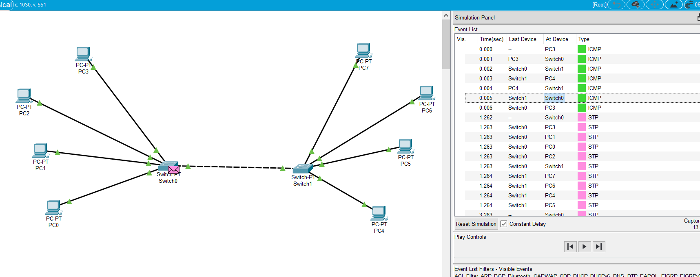
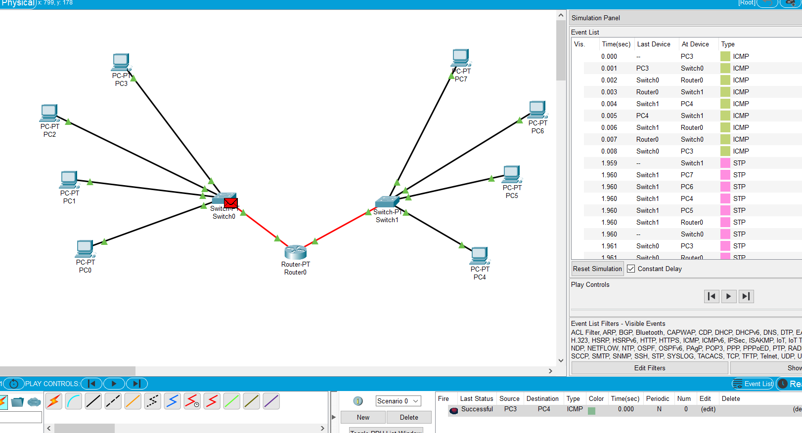
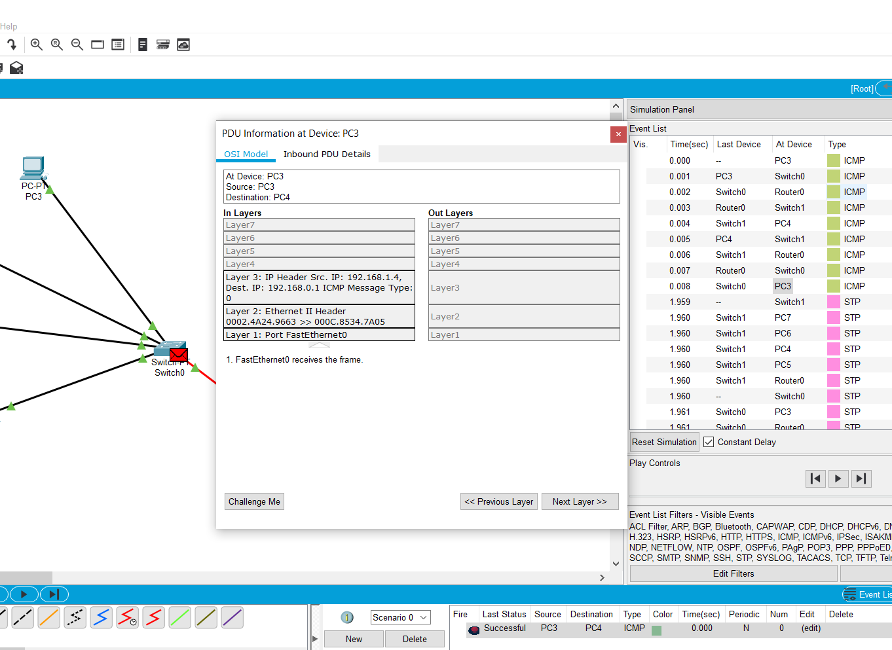

<h1>Task 4.1: Network</h1>
	  

<h2>A router serves to link different networks and architectures. It operates at the network level of the OSI, while switches and hubs operate at the physical and data link levels. Helps reduce network congestion by dividing into collision domains or broadcast domains and packet filtering</h2>