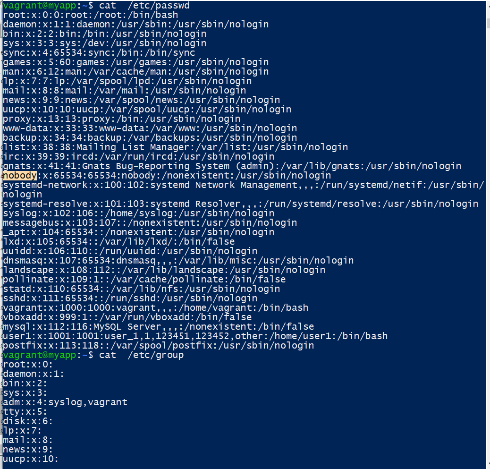
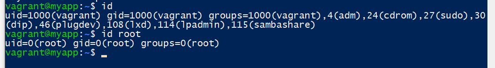
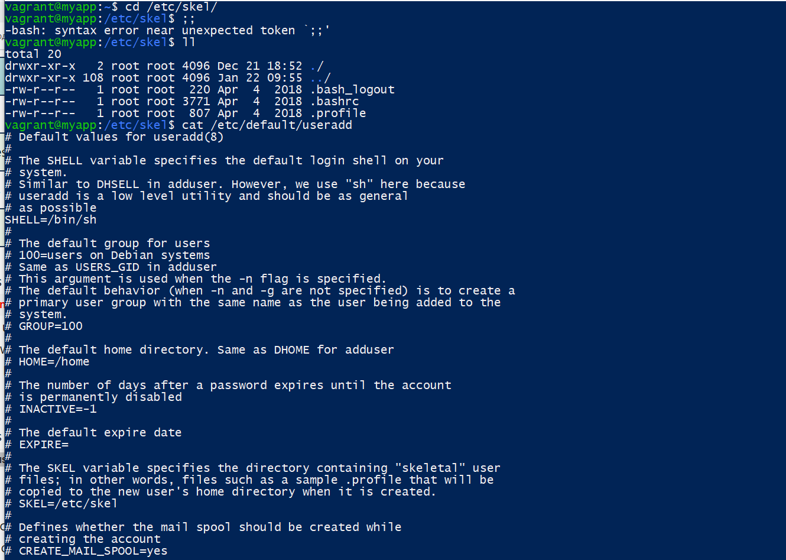
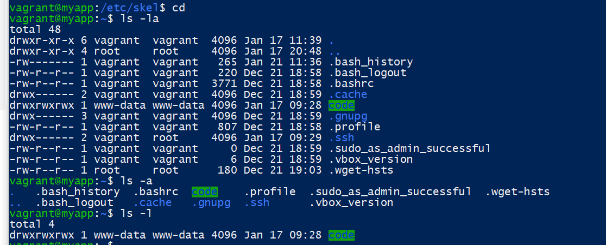
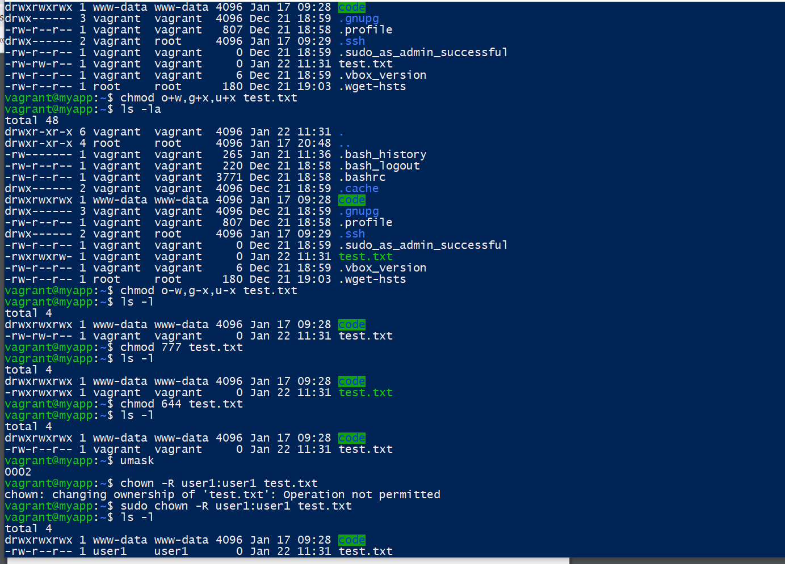
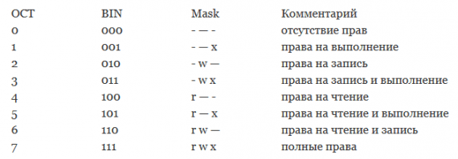
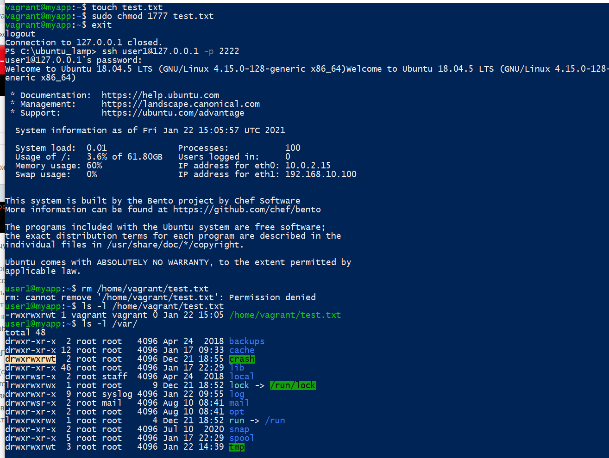

<h1>Task 2.1: Linux</h1>
	  

1. Username: It is used when user logs in.

2. Password: An x character indicates that encrypted password is stored in /etc/shadow file. Please note that you need to use the passwd command to computes the hash of a password typed at the CLI or to store/update the hash of the password in /etc/shadow file.

3. User ID (UID): Each user must be assigned a user ID (UID). UID 0 (zero) is reserved for root and UIDs 1-99 are reserved for other predefined accounts. Further UID 100-999 are reserved by system for administrative and system accounts/groups.

4. Group ID (GID): The primary group ID (stored in /etc/group file)

5. GECOS or the full name of the user. This field contains a list of comma-separated values with the following information: 
User’s full name or the application name. 
Room number. 
Work phone number. 
Home phone number. 
Other contact information.

6. Home directory. The absolute path to the user’s home directory. It contains the user’s files and configurations. By default, the user home directories are named after the name of the user and created under the /home directory.

7. Login shell. The absolute path to the user’s login shell. This is the shell that is started when the user logs into the system. On most Linux distributions, the default login shell is Bash.

Pseudo users accounts UIDs 1-999(daemons, pseudo-users, system and reserved users). To defend against
remote login attacks (when SSH key files are used instead of passwords), specify /bin/false or
/bin/nologin as shells (instead of /bin/bash or /bin/sh) 

Uid is a simple numeric designation for an individual user. This is usually a positive number not more
than 65535 (sometimes 32-bit). Some identifiers are reserved for special use. These include 0 (root),
1-999(daemons, pseudo-users, system and reserved users), 1000+ (regular users).

Gid - unique identifier of the group within the system to which the user belongs

<strong>Commands for working with user accounts:</strong>

1) useradd [-c uid comment] [-d dir] [-e expire] [-f inactive] [-g gid] [-m [-k skel_dir]] [-s shell]

[-u uid [-o]] username

2) userdel [-r] username

3) usermod [-c uid comment] [-d dir [-m]] [-e expire] [-f inactive] [-g gid] [-G gid [, gid]]

[-l new username] [-s shell] [-u uid [-o]] username

<strong>Rename user:</strong>

usermod -l login-name old-name

usermod -u UID username

<strong>Remove user with his directory and mail:</strong>userdel -r username

<strong>Lock/unlock users</strong>passwd -l username; passwd -u username

<strong>Cancel password</strong>passwd -d username

ls -la;  Command show following file information:
1. The file type. 
2. The file permissions. 
3. Number of hard links to the file. 
4. File owner. 
5. File group. 
6. File size. 
7. Date and Time. 
8. File name. 

<strong>Permissions:</strong> 
The first character indicates the file type: 
- - regular file; 
d - directory; 
b - block device; 
c - character device; 
l - symbolic link; 
p - pipe (pipe, fifo); 
s - socket. Nine characters representation as "rwxrwxrwx", where some "r", "w" and "x" can be replaced with "-". 
Symbols reflect the three types of access accepted in Linux - read, write and use - however they are 
present in triplicate in the shortcut.

When the relationship between the file and the user who started the process, the role is determined as
follows: 
If the UID of the file is the same as the UID of the process, the user is the owner of the file 
If the GID of the file matches the GID of any group the user belongs to, he is a member of the group to
which the file belongs. 
If neither the UID no the GID of a file overlaps with the UID of the process and the list of groups that the
user running it belongs to, that user is an outside

Octal value : Permission

0 : read, write and execute

1 : read and write

2 : read and execute

3 : read only

4 : write and execute

5 : write only

6 : execute only

7 : no permissions

The umask masks default permission levels by qualifying them with a certain value. umask command output contains permissions bits that will NOT be set in newly created files and directories. If umask= 022, default permissoon for files is: 666 – 022 = 644

chmod ugo+rwx file.txt 
chmod ugo-x file.txt 
chmod o-x file.txt 
chmod o+x file.txt 
