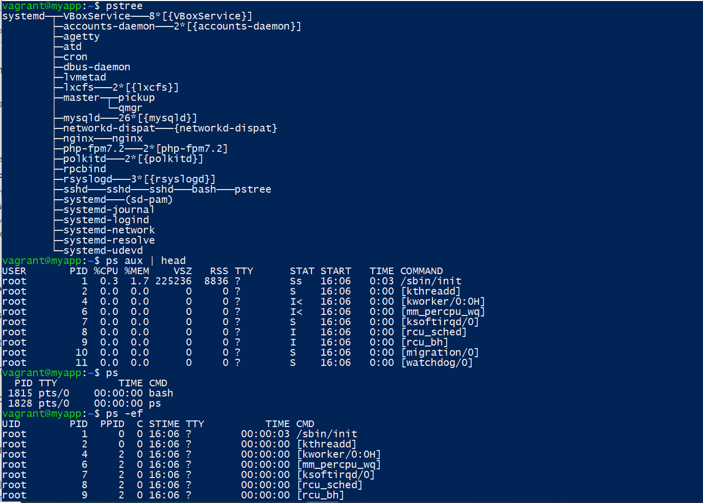
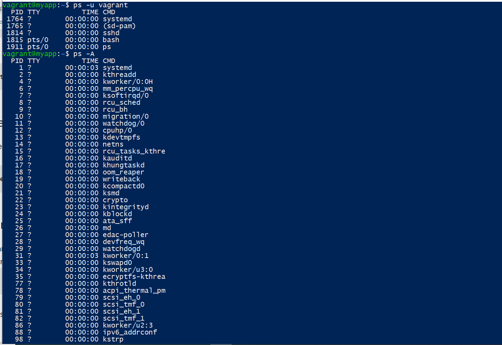
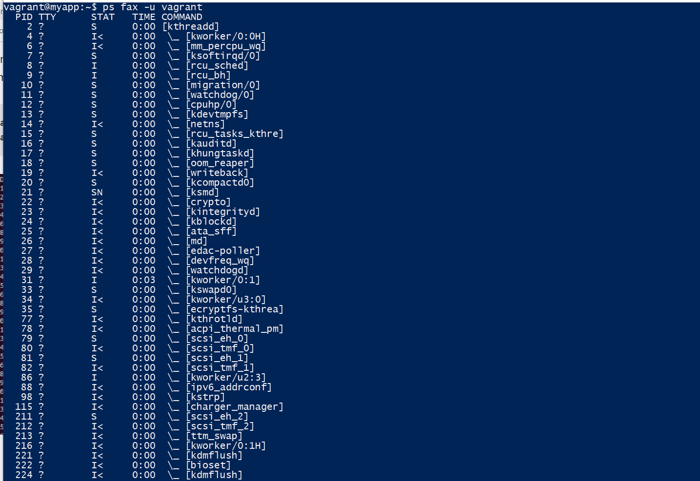
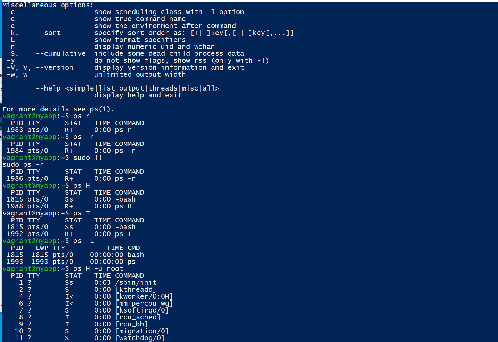
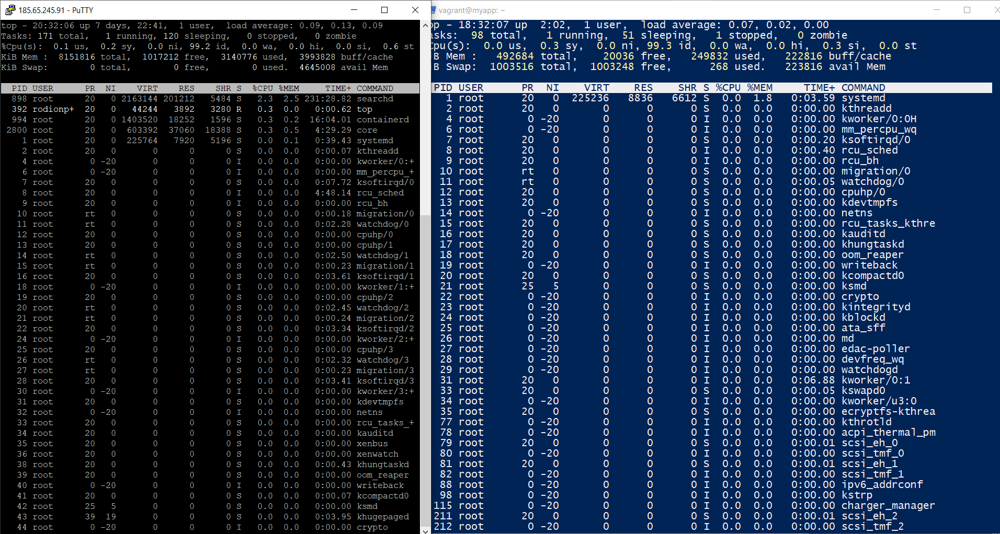
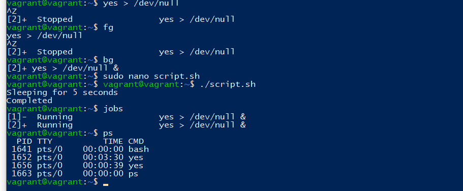
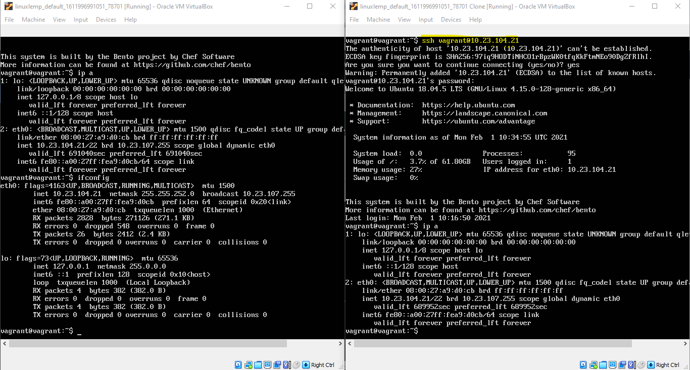
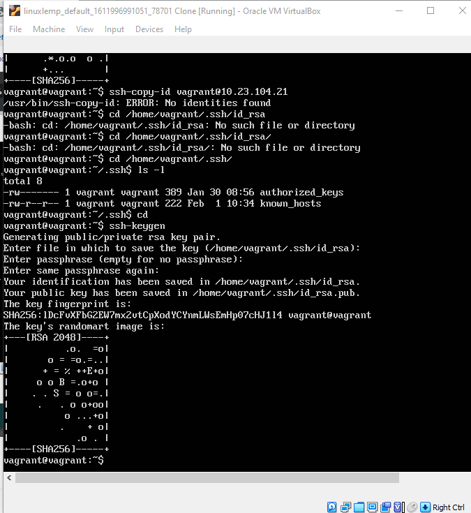
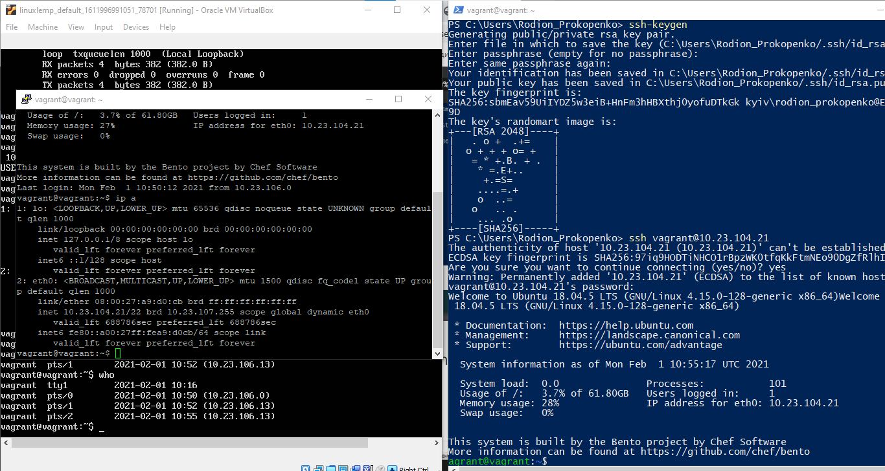
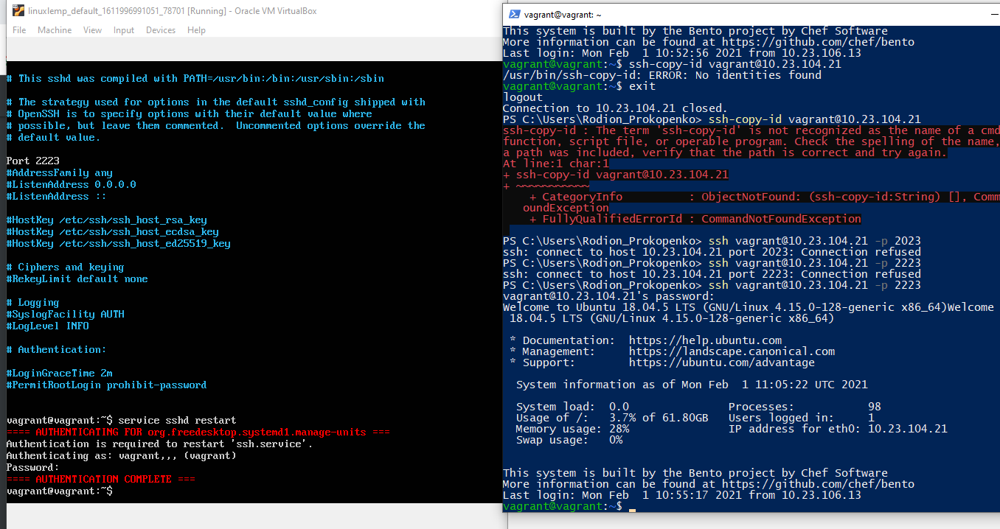

<h1>Task 3.1: Linux</h1>

Linux has basically 5 states:

Running/Runnable (R): running processes are processes using a CPU core right now, a runnable process is a process that has everything to run and is just waiting for a CPU core slot.

Sleeping: a sleeping process is a process waiting for a resource to be available (for example, a I/O operation to complete) or an event to happen (like a certain amount of time to pass). The difference between process in Interruptible Sleep (S) state and Uninterruptible Sleep (D) is that the former will wake up to handle signals while the former won't. 

Stopped (T): a process becomes stopped when it receives the SIGSTOP signal (not unlike when you press <ctrl>+z in the shell, although <ctrl>+z sends a SIGTSTP instead). When stopped, the process execution is suspended and the only signals it will handle are SIGKILL and SIGCONT. The former will remove the process permanently, while the later will put the process back to the Running/Runnable state (like when you run fg or bg after pressing <ctrl>+z in the shell).

Zombie (Z): When a process finishes with exit() system call, its state needs to be "reaped" by its parent (calling wait()); in the meantime, the child process remains in zombie state (not alive nor dead).

	  

The proc filesystem (procfs) is a special filesystem in Unix-like operating systems that presents information about processes and other system information in a hierarchical file-like structure, providing a more convenient and standardized method for dynamically accessing process data held in the kernel than traditional tracing methods or direct access to kernel memory. 

Typically, it is mapped to a mount point named /proc at boot time. The proc file system acts as an interface to internal data structures in the kernel. It can be used to obtain information about the system and to change certain kernel parameters at runtime

The kernel space is a space reserved to the Kernel in order for it to run essential system tools properly and to make sure that your entire host is running in a consistent way.User-space processes have its own virtual address space.

On the other hand, user space is reserved for processes launched by the user and managed by the kernel itself.Kernel processes or threads do not have their own address space, they operate within kernel address space only. And they may be started before the kernel has started any user process (e.g. init).

<h4>Processes states</h4>

D Uninterruptible sleep (usually IO)

R Running or runnable (on run queue)

S Interruptible sleep (waiting for an event to complete)

T Stopped, either by a job control signal or because it is being traced.

W paging (not valid since the 2.6.xx kernel)

X dead (should never be seen)

Z Defunct ("zombie") process, terminated but not reaped by its parent.

< high-priority (not nice to other users)

N low-priority (nice to other users)

L has pages locked into memory (for real-time and custom IO)

s is a session leader

l is multi-threaded (using CLONE_THREAD, like NPTL pthreads do)

+ is in the foreground process group 

Top command gives an overview of the most
active processes currently running (hence the name top).
 
This enables you to easily find processes
that might need attention. From top, you can also perform common process management tasks, such
as adjusting the current process priority and killing processes

Commands for top:

-b	Batch-mode operation Starts top in 'Batch' mode, which could be useful for sending output from top to other programs or to a file

-c	Command-line/Program-name toggle Starts top with the last remembered 'c' state reversed. Thus, if top was displaying command lines, now that field will show program names, and visa versa. See the 'c' interactive command for additional information

-H	Threads-mode operation Instructs top to display individual threads

-i	Idle-process toggle Starts top with the last remembered 'i' 

-ppid	Monitor-PIDs mode, specified as: -ppid1 -ppid2 ... or -ppid1,pid2,pid3

-s	Secure-mode operation Starts top with secure mode forced, even for root.

To renice a running process from top, type r 
 
You are first prompted for the PID of the process you
want to renice. 

After entering the PID, you are prompted for the nice value you want to use. Enter a
positive value to increase process priority or a negative value to decrease process priority.

When use top, we can kill processes with k key. After we enter k top ask the PID, then asks which signal we want to send.

By default, signal 15 for SIGTERM,
9 for SIGKILL.

Commands launched from the & end go into the background and become a job.

The jobs command helps to display a list of such commands, and to switch between jobs use:
fg (send a background task to the shell) / bg (send a stopped task to the background).
 

The nohup utility allows you to keep the process running in the background when you log off.

