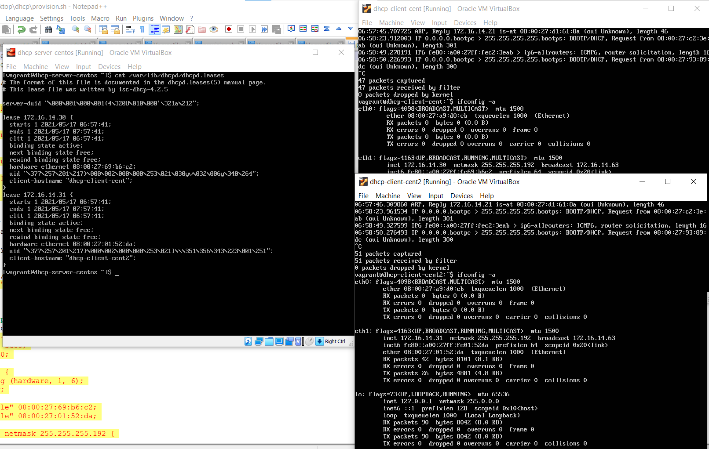

<h1> Set 2 DHCP Servers on Ubuntu and Centos 7, in one private network.</h1>
<h2>Create private network. Dhcp servers need to set bridget adaptor, and created network for interface eth1. For clients set Nat, and our network for eth1.</h2>

<h2>The script have created a service that will record traffic for our eth1, include the DORA process of receiving an ip to a file for Wireshark. </h2>

